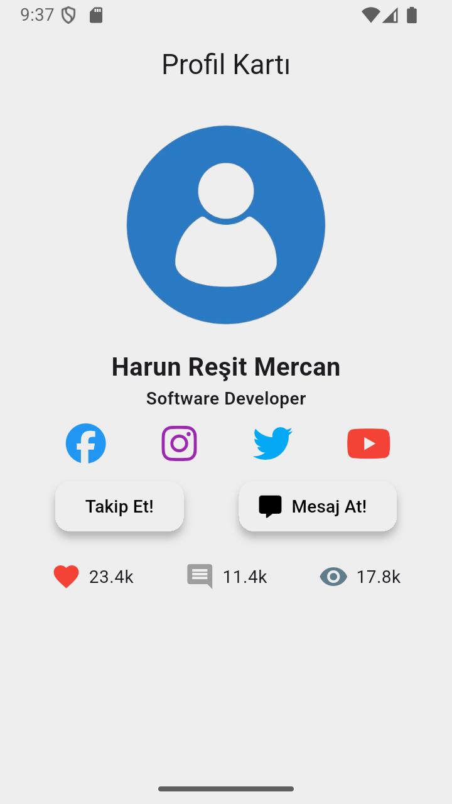

# Profil Kartı Uygulaması

Bu proje, Flutter kullanılarak geliştirilmiş basit ve modern bir profil kartı kullanıcı arayüzü (UI) çalışmasıdır.

## Ekran Görüntüsü

## Açıklama

Bu uygulama, bir kullanıcının profil bilgilerini, sosyal medya bağlantılarını ve etkileşim istatistiklerini gösteren statik bir arayüz içerir. Flutter'ın temel widget'ları kullanılarak temiz ve anlaşılır bir tasarım hedeflenmiştir.

